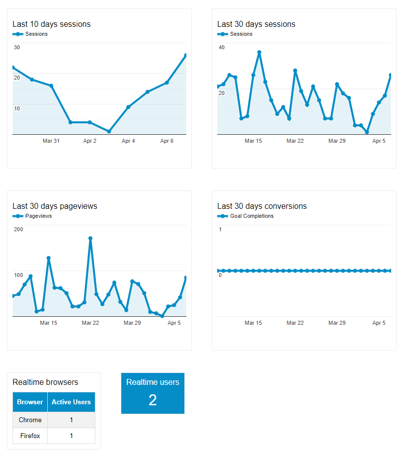

# react-analytics-widget

[![npm package][npm-badge]][npm]

Embed Google Analytics widgets in your React applications.

 - The `GoogleProvider` container ensure user is logged on analytics
 - The `GoogleDataChart` component display any [DataChart configuration](https://developers.google.com/analytics/devguides/reporting/embed/v1/component-reference#datachart)
 - The `GoogleDataRT` component display any [RealTime](https://developers.google.com/analytics/devguides/reporting/realtime/dimsmets/) data




Demo : [https://revolunet.github.io/react-analytics-widget](https://revolunet.github.io/react-analytics-widget)

## Requirements

You need to create a OAUTH client id in the [google developer console](https://console.developers.google.com/apis/credentials/oauthclient/960315238073-dv345fcj3tkikn506k9lrch73hk9259u.apps.googleusercontent.com?project=eastern-store-174123) and provide an [analytic view ID](https://ga-dev-tools.appspot.com/query-explorer/).
Alternatively you can use server-side authentication tokens. You can find more info in this [example](https://ga-dev-tools.appspot.com/embed-api/server-side-authorization/).

### Note:
If you provide values for both the `accessToken` and the `clientId` props, the latter will be ignored.

Also, add the Google SDK at the top of your page

```js
;(function(w, d, s, g, js, fjs) {
  g = w.gapi || (w.gapi = {})
  g.analytics = {
    q: [],
    ready: function(cb) {
      this.q.push(cb)
    }
  }
  js = d.createElement(s)
  fjs = d.getElementsByTagName(s)[0]
  js.src = "https://apis.google.com/js/platform.js"
  fjs.parentNode.insertBefore(js, fjs)
  js.onload = function() {
    g.load("analytics")
  }
})(window, document, "script")
```

## Usage
### Customizable props
You can pass custom props to customize the visualizations.
#### Data configuration
```js
// Last 30 days analytics
const last30days = {
  query: {
    dimensions: "ga:date",
    metrics: "ga:pageviews",
    "start-date": "30daysAgo",
    "end-date": "yesterday"
  },
  chart: {
    type: "LINE", // Possible options are: LINE, COLUMN, BAR, TABLE, and GEO.
    options: {
      // options for google charts
      // https://google-developers.appspot.com/chart/interactive/docs/gallery
      title: "Last 30 days pageviews"
    }
  }
};

// Realtime users
const activeUsers = {
  pollingInterval: 5, // 5 seconds minimum
  options: {
    title: 'Realtime users'
  },
  query: {
    metrics: 'rt:activeUsers'
  }
};

// ...
<GoogleDataChart config={last30days} ... />
<GoogleDataRt config={activeUsers} ... />
// ...
```

#### Views
```js
// analytics views ID
const views = {
  query: {
    ids: "ga:87986986"
  }
};
// ...
<GoogleDataChart views={views} ... />
<GoogleDataRT views={views} ... />
// ...
```

#### Loader
```js
// By default a css spinner is used
const loader = '<span>Loading...</span>';
// ...
<GoogleDataChart loader={loader} ... />
<GoogleDataRT loader={loader} ... />
// ...
```

#### Errors
```js
// By default the errors are hidden (quota, bad view id, insufficient permissions, missing or wrong parameters, etc)
// ...
const errors = true;
<GoogleDataRT errors={errors} ... />
// ...
```

#### Custom output (only in GoogleDataRT)
```js
/**
 * RealTime data is not supported by the official DataChart api,
 * so we have to make custom visualizations. These values
 * can be returned as an unique number (a total count)
 * or as multiples columns (dimensions) that can been displayed as tables or charts.
 * By default the data is visualizated as a number or a table in each case,
 * but you can customize the api's response visualization using this prop.
 * 
 * @param {object} realTimeData Google Api response
 * @param {array}  realTimeData.columnHeaders Name of the columns returned
 * @param {string} realTimeData.ids
 * @param {string} realTimeData.kind
 * @param {object} realTimeData.profileInfo
 * @param {string} realTimeData.query
 * @param {array}  [realTimeData.rows] Rows if there is results
 * @param {string} realTimeData.selfLink
 * @param {number} realTimeData.totalResults Total count
 * @param {object} realTimeData.totalsForAllResults
 * @returns {Component}
 */
 const customOutput = (realTimeData) => { 
  return (
    <div className="my-custom-visualization">
    ...
    </div>
  ) 
};
// ...
<GoogleDataRT customOutput={customOutput} ... />
// ...
```

### OAUTH authentication

```js
import { GoogleProvider, GoogleDataChart, GoogleDataRT } from 'react-analytics-widget';

const CLIENT_ID = 'x-x--x---x---x-xx--x-apps.googleusercontent.com';

// graph 1 config
const last30days = {
  query: {
    dimensions: "ga:date",
    metrics: "ga:pageviews",
    "start-date": "30daysAgo",
    "end-date": "yesterday"
  },
  chart: {
    type: "LINE",
    options: {
      // options for google charts
      // https://google-developers.appspot.com/chart/interactive/docs/gallery
      title: "Last 30 days pageviews"
    }
  }
};

// graph 2 config
const realTimeBrowsers = {
  pollingInterval: 1000,
  options: {
    title: "Realtime browsers"
  },
  query: {
    metrics: 'rt:activeUsers',
    dimensions: 'rt:browser'
  }
};

// analytics views ID
const views = {
  query: {
    ids: "ga:87986986"
  }
};

const Example = () => (
  <GoogleProvider clientId={CLIENT_ID}>
    <GoogleDataChart views={views} config={last30days} />
    <GoogleDataRT views={views} config={realTimeBrowsers} />
  </GoogleProvider>
)
```

### Server-side token authentication

```js
import React, { Component } from 'react';
import { GoogleProvider, GoogleDataChart, GoogleDataRT } from 'react-analytics-widget'

// graph 1 config
const last7days = {
  query: {
    dimensions: "ga:date",
    metrics: "ga:pageviews",
    "start-date": "7daysAgo",
    "end-date": "yesterday"
  },
  chart: {
    type: "LINE"
  }
};

// graph 2 config
const realTimeBrowsers = {
  pollingInterval: 1000,
  options: {
    title: "Realtime browsers"
  },
  query: {
    metrics: 'rt:activeUsers',
    dimensions: 'rt:browser'
  }
};

// analytics views ID
const views = {
  query: {
    ids: "ga:87986986"
  }
};

class Example extends Component {
  componentDidMount = () => {
    const request = new Request('https://yourserver.example/auth/ganalytics/getToken', {
      method: 'GET'
    });
    fetch(request)
      .then(response => response.json())
      .then(({ token }) => {
        this.setState({ token }); // TODO: handle errors
      });
  };

  render = () => (
    <GoogleProvider accessToken={this.state.token}>
      <GoogleDataChart views={views} config={last7days} />
      <GoogleDataRT views={views} config={realTimeBrowsers} />
    </GoogleProvider>
  )
};
```

[npm-badge]: https://img.shields.io/npm/v/react-analytics-widget.png?style=flat-square
[npm]: https://www.npmjs.org/package/react-analytics-widget
