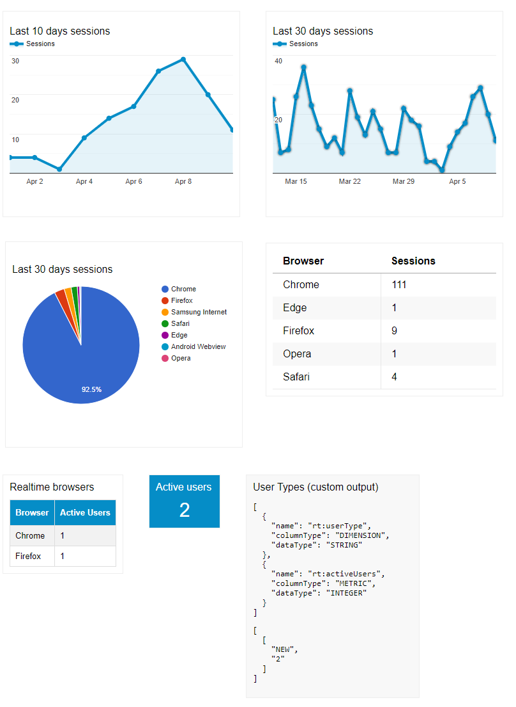

# react-analytics-widget

[![npm package][npm-badge]][npm]

Embed Google Analytics widgets in your React applications.

 - The `GoogleProvider` container ensure user is logged on analytics
 - The `GoogleDataChart` component display any [DataChart configuraton](https://developers.google.com/analytics/devguides/reporting/embed/v1/component-reference#datachart)
 - The `GoogleDataLive` component display the [Active Users](https://developers.google.com/analytics/devguides/reporting/realtime/dimsmets/user#rt:activeUsers) in Real Time




Demo : [https://revolunet.github.io/react-analytics-widget](https://revolunet.github.io/react-analytics-widget)

## Requirements

You need to create a OAUTH client id in the [google developer console](https://console.developers.google.com/apis/credentials/oauthclient/960315238073-dv345fcj3tkikn506k9lrch73hk9259u.apps.googleusercontent.com?project=eastern-store-174123) and provide an [analytic view ID](https://ga-dev-tools.appspot.com/query-explorer/).
Alternatively you can use server-side authentication tokens. You can find more info in this [example](https://ga-dev-tools.appspot.com/embed-api/server-side-authorization/).

### Note:
If you provide values for both the `accessToken` and the `clientId` props, the latter will be ignored.

Also, add the Google SDK at the top of your page

```js
;(function(w, d, s, g, js, fjs) {
  g = w.gapi || (w.gapi = {})
  g.analytics = {
    q: [],
    ready: function(cb) {
      this.q.push(cb)
    }
  }
  js = d.createElement(s)
  fjs = d.getElementsByTagName(s)[0]
  js.src = "https://apis.google.com/js/platform.js"
  fjs.parentNode.insertBefore(js, fjs)
  js.onload = function() {
    g.load("analytics")
  }
})(window, document, "script")
```

Additionally add this if you want to use the GoogleDataLive component
```html
<!-- Include the ActiveUsers component script. -->
<script src="https://ga-dev-tools.appspot.com/public/javascript/embed-api/components/active-users.js"></script>

<!-- Include the CSS that styles the charts. -->
<link rel="stylesheet" href="https://ga-dev-tools.appspot.com/public/css/chartjs-visualizations.css">
```

## Usage
### OAUTH authentication

```js

import { GoogleProvider, GoogleDataChart, GoogleDataLive } from 'react-analytics-widget'

const CLIENT_ID = 'x-x--x---x---x-xx--x-apps.googleusercontent.com';

// graph 1 config
const last30days = {
  reportType: "ga",
  query: {
    dimensions: "ga:date",
    metrics: "ga:pageviews",
    "start-date": "30daysAgo",
    "end-date": "yesterday"
  },
  chart: {
    type: "LINE",
    options: {
      // options for google charts
      // https://google-developers.appspot.com/chart/interactive/docs/gallery
      title: "Last 30 days pageviews"
    }
  }
}

// graph 2 config
const last7days = {
  reportType: "ga",
  query: {
    dimensions: "ga:date",
    metrics: "ga:pageviews",
    "start-date": "7daysAgo",
    "end-date": "yesterday"
  },
  chart: {
    type: "LINE"
  }
}

const activeUsers = {
  reportType: "realtime",
  pollingInterval: 5, // 5 seconds minimum
  template: '<div class="ActiveUsers">Active Users: <b class="ActiveUsers-value"></b></div>',
  query: {
    metrics: 'rt:activeUsers'
  }
}

// analytics views ID
const views = {
  query: {
    ids: "ga:87986986"
  }
}

const Example = () => (
  <GoogleProvider clientId={CLIENT_ID}>
    <GoogleDataChart views={views} config={last30days} />
    <GoogleDataChart views={views} config={last7days} />
    <GoogleDataLive views={views} config={activeUsers} />
  </GoogleProvider>
)
```

### Server-side token authentication

```js

import React, { Component } from 'react';
import { GoogleProvider, GoogleDataChart } from 'react-analytics-widget'

// graph 1 config
const last30days = {
  reportType: "ga",
  query: {
    dimensions: "ga:date",
    metrics: "ga:pageviews",
    "start-date": "30daysAgo",
    "end-date": "yesterday"
  },
  chart: {
    type: "LINE",
    options: {
      // options for google charts
      // https://google-developers.appspot.com/chart/interactive/docs/gallery
      title: "Last 30 days pageviews"
    }
  }
}

// graph 2 config
const last7days = {
  reportType: "ga",
  query: {
    dimensions: "ga:date",
    metrics: "ga:pageviews",
    "start-date": "7daysAgo",
    "end-date": "yesterday"
  },
  chart: {
    type: "LINE"
  }
}

// analytics views ID
const views = {
  query: {
    ids: "ga:87986986"
  }
}

const activeUsers = {
  ids: "ga:87986986",
  reportType: "realtime",
  pollingInterval: 5, // 5 seconds minimum
  template: '<div class="ActiveUsers">Active Users: <b class="ActiveUsers-value"></b></div>',
  query: {
    metrics: 'rt:activeUsers'
  }
}

class Example extends Component {
  componentDidMount = () => {
    const request = new Request('https://yourserver.example/auth/ganalytics/getToken', {
      method: 'GET'
    });
    fetch(request)
      .then(response => response.json())
      .then(({ token }) => {
        this.setState({ token }); // TODO: handle errors
      });
  }

  render = () => (
    <GoogleProvider accessToken={this.state.token}>
      <GoogleDataChart views={views} config={last30days} />
      <GoogleDataChart views={views} config={last7days} />
      <GoogleDataLive views={views} config={activeUsers} />
    </GoogleProvider>
  )
}
```

[npm-badge]: https://img.shields.io/npm/v/react-analytics-widget.png?style=flat-square
[npm]: https://www.npmjs.org/package/react-analytics-widget
